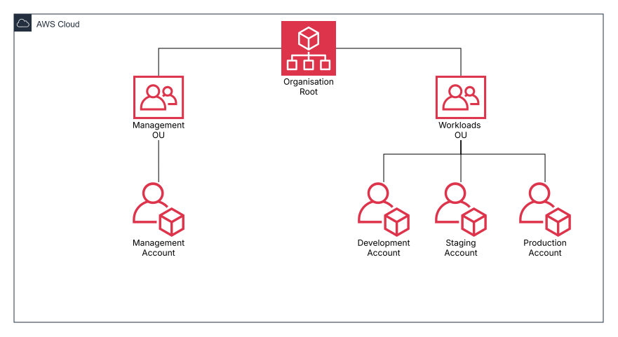

# AWS Multi‑Account Architecture for Personal Projects

A clean, enterprise‑grade AWS multi‑account setup designed for my own personal projects, experimentation, and portfolio development. This repository demonstrates strong governance, environment isolation, and AWS best practices across Development, Staging, Production, and Management accounts.

## 📘 Bootstrap Architecture Overview

This project follows a modern AWS multi‑account pattern, using AWS Organisations, Identity Center, created manually in the AWS console as per AWS best practice. As well as initial bootstrap terraform to create the backbone for future projects.

## 🎯 Purpose of This Repository

This repository exists to:

- Showcase a professional, scalable AWS multi‑account design.
- Demonstrate Terraform‑driven infrastructure automation.
- Provide a safe, isolated environment for experimentation.
- Maintain strong governance and cost‑control boundaries.
- Serve as a portfolio centrepiece for cloud and DevOps engineering.

## 🏛️ Account Structure

Each AWS account has a clear, single responsibility. This separation ensures safety, clarity, and predictable deployments. Created in the AWS console, as per AWS best practice.

| Account      | Purpose                                    |
|--------------|--------------------------------------------|
| Management   | Governance, Billing, SCPs, Identity Center |
| Development  | Ephemeral Testing & Experimentation        |
| Staging      | Pre‑Production Validation & Testing        |
| Production   | Live Workloads & Public Projects           |

## 🗂️ Organisational Unit Structure

The AWS Organisation is intentionally simple:

- **Root**
  - **Management OU**
    - `<org>-Management`
  - **Workloads OU**
    - `<org>-Development`
    - `<org>-Staging`
    - `<org>-Production`

## 📚 Additional Documentation

This repository includes detailed documentation for every part of the AWS multi‑account setup.  
Browse the full documentation here:

### 🏗️ Account Creation
- [Management Account](docs/account-creation/management-account.md)
- [Development Account](docs/account-creation/development-account.md)
- [Staging Account](docs/account-creation/staging-account.md)
- [Production Account](docs/account-creation/production-account.md)

### 🔐 Security & Governance
- [IAM Best Practices](docs/security/iam-best-practices.md)
- [Service Control Policies (SCPs)](docs/backend-design/SCPs.md)

### 🗄️ Terraform Backend Design
- [Terraform State](docs/backend-design/terraform-state.md)

### 🏛️ Organisation & Structure
- [OU Structure](docs/organization/ou-structure.md)
- [Naming Conventions](docs/organization/naming-conventions.md)

You can also browse everything directly in the `/docs` folder:

➡️ **[`/docs`](./docs/)**  

---